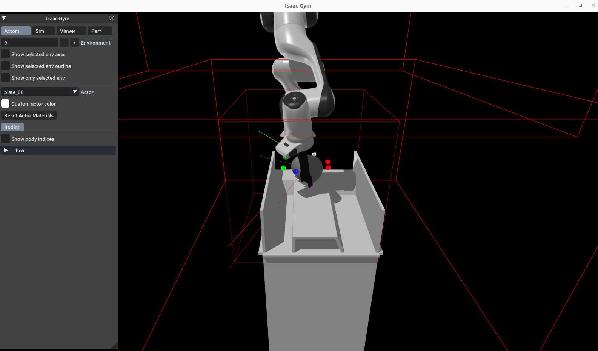

## Scripts

This directory holds all entrypoints regarding the `ham` python package inside the docker environment.

### Visualize Pretrained Policy

First, make sure that the visualization inside the docker container is enabled:

Outside docker:

```bash
echo $DISPLAY # check the value of the display
# xhost + # do this ONLY if your container lacks xserver privileges
```

Inside docker:
```bash
export DISPLAY=...
```

Afterward,

```bash
cd ham/scripts/
python3 test.py ++load_ckpt=HAMNet/public:pretrained ++global_device=cuda:0 ++env.use_viewer=1 ++env.single_object_scene.load_episode=/tmp/docker/eps-demo-16x8.pth ++draw_debug_lines=1
```

You should see a visualization GUI pop up, like below:


### Evaluate Pretrained Policy Performance

```bash
cd ham/scripts/
python3 test.py ++load_ckpt=HAMNet/public:pretrained ++global_device=cuda:0 ++env.use_viewer=0 ++env.single_object_scene.qrand_prior=10.0 ++env.single_object_scene.tight_prior=5.0 ++test_steps=4097 ++env.single_object_scene.load_episode=/tmp/docker/eps-fr3-near-and-rand-1024x384.pth
```

In the terminal, you should see the progress bar and periodic logs like the following:
```bash
rppo.test:  93%|██████████   | 960/1028 [00:51<00:03, 19.37it/s$
# ...
env/00/num_episodes=201
env/00/num_success=157
env/00/suc_rate=0.7810945510864258
env/00/cur_suc_rate=0.7810945510864258
# ...
```


### Train the policy from scratch

```bash
cd ham/scripts/
python3 train.py ++global_device=cuda:0
# Optionally, to test without wandb/huggingface integration:
# python3 train.py ++global_device=cuda:0 ++use_wandb=false ++use_hfhub=fals
```

After a set of debug logs related to isaac gym, you should see the following output in your terminal (shortened a bit for readability):

```bash
# ...
wandb: Currently logged in as: yycho0108. Use `wandb login --relogin` to force relogin
# ...
wandb: Run data is saved locally in /input/HAMNet/ham/scripts/wandb/run-20250816_141256-cae2g0xf
wandb: Run `wandb offline` to turn off syncing.
wandb: Syncing run rss-rss_env-rss_net-rss-056381
# ...
mixed_reset:  41%|████████████████| 123/300 [00:14<00:17, 10.27it/s]
{'actn': {'s': torch.Size([10, 1024, 21]) ...}}
rss-rss_env-rss_net-rss-056381@/tmp/ham/ppo/run-XXX:   0%|    | 61/2000000 [00:07<61:24:06,  9.05it/s$
```
